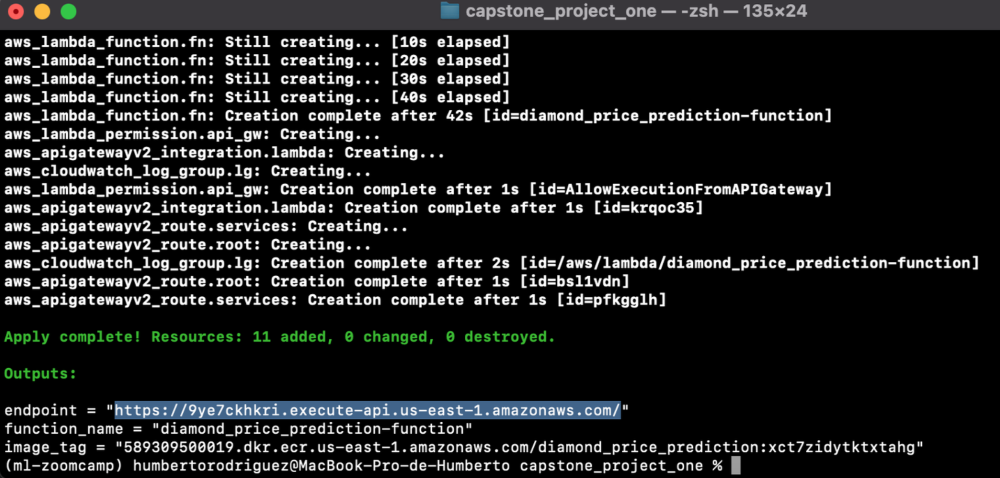

## How the model was built and containerized

The model was built with BentoML, which is an abstraction to pack different Machine Learning components into one deployable unit. you can `pip install bentoml` to install it. You can visit: [BentoML](https://docs.bentoml.org/en/latest/index.html) for further details.

In order to build your model with BentoML import bentoml and run in your code of your final selected model the following lines:

`bentoml.xgboost.save_model("diamond_price_prediction", model,
                          custom_objects={
                              "dictVectorizer": dv
                          })`

This will provide a model with a tag which will be used to build our bento image and docker image:

Before we can build our images:

1. Create a service.py file see: [service.py file](service.py)

2. Next step, we need to create a bentofile.yaml specifiying the following:

- service: "service.py:svc" -> Determine the entry point and the variable name for the service. We wont have to specify it anymore since we have called it out in the service.

- labels: key value pair specify anything that is valuable to your and your business of what is involved in this bento.

  - owner: hr
  - project: default-prediction

- include: which files you want to include/pull in with your bento and which don't specially if your bento is part of a larger repo.

  - "\*.py"

- python: which python packages you need for your service.
  - packages:
    - xgboost
    - scikit-learn==1.1.1
    - numpy==1.21.5
    - pydantic==1.10.2

3. Now we can build our deployable, from the CLI type:

`bentoml build`

This deployable includes all the things that we are going to need for a service in one single place, so when we containerize it you have a single image that you can deploy into a lot of different environments. This deployable includes:

- README files ->
- openapi.yaml -> which is the spec that enables you to have the Swagger UI
- bento.yaml -> the file that glues everything together
- Dockerfile
- python requirements
- models -> where it shows our custom objects, where the DictVectorizer is stored

5. Now we can build our Docker image:

`bentoml containerize <tag of your previous BentoML deployable you built>`

When it finishes, it will provide your Docker image with a command to run it locally. From your terminal you can run it: `docker run -it --rm -p 3000:3000 <tag of your containerized image>`

## Deploying to AWS Lambda

In order to deploy to AWS Lambda we will use `bentoctl`. With this tool, we are able to deploy our bentos to a variety of different locations.

First we will install our tools needed. If you are in mac you can:

`pip install bentoctl`
`brew tap hashicorp/tap`
`brew install hashicorp/tap/terraform`

1. Once installed we need to run:

`bentoctl init`

It will ask for:

- the name of the deployment that in our case is: diamond_price_prediction
- region: us-east-1
- timeout: 10
- memory: 512

What `bentoml init` is doing is initializing our project with all of the variables that we set during the init command.

If we do `ls` in our project folder, we will notice that some files were automatically created:

- deployment_config.yaml
- terraform.py
- bentoctl.tfvars

2. The next thing we are going to do is the build command, so for Lambda or any other services the first thing bentctl is going to do is build the
   bento. However, it needs to be built in order to deploy it in the service that you are targeting. Make sure Docker is on.

`bentoctl build -b <image name you previously built with *bentoml build* command>-f deployment_config.yaml`

The above command is going to build my Lambda image that is going to be pushed to AWS. This command not only builds the container, but also pushes
to a remote repository in ECR, it starts up automatically when you do the build itself.

3. Next step is to run:

`terraform init`

Based on the main.tf file, it will calculate what it needs to deploy to Amazon in order to make sure to make that whole
TF file exists in AWS, even when it is updated.

4. The next thing we are going to do is after we initialized our state file, we are going to call terraform apply using the variable file
   that was autogenrated for us:

`terraform apply -var-file=bentoctl.tfvars -auto-approve`

5. Finally we will get our endpoint:

For more details and other deployment locations visit [the official bentoctl GitHub](https://github.com/bentoml/bentoctl)!
