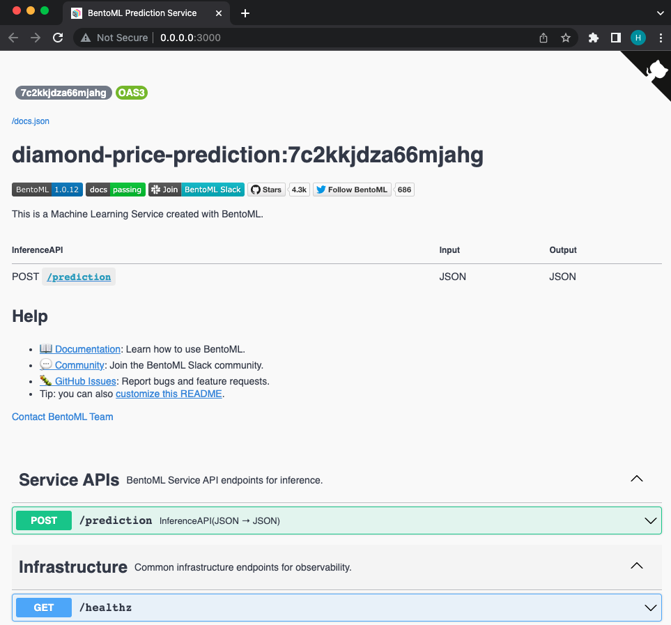
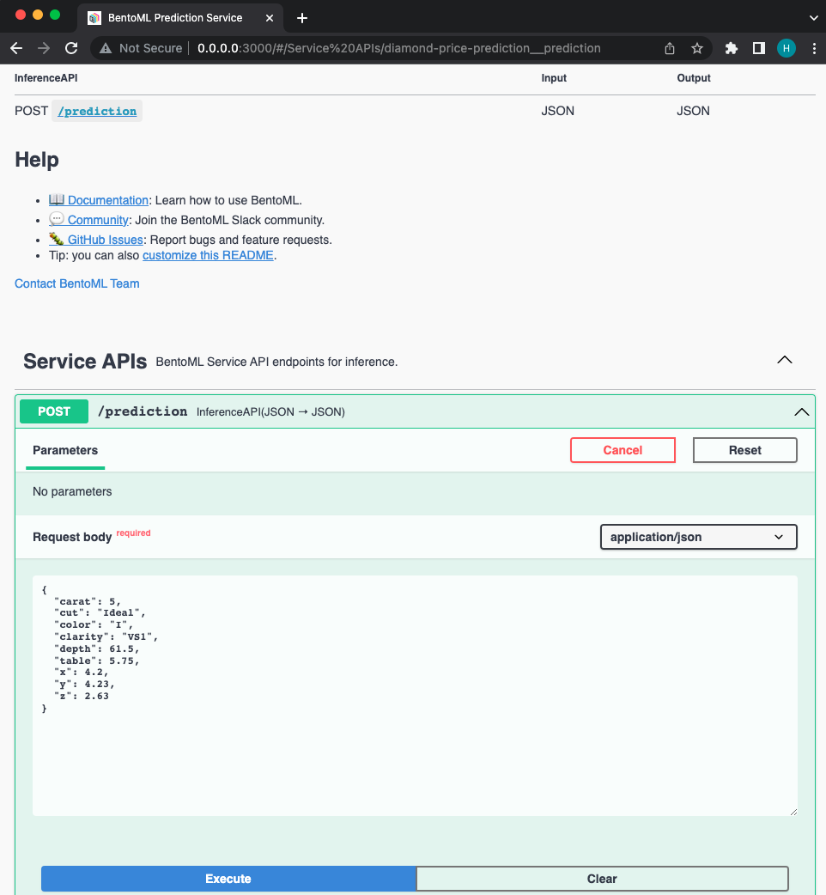
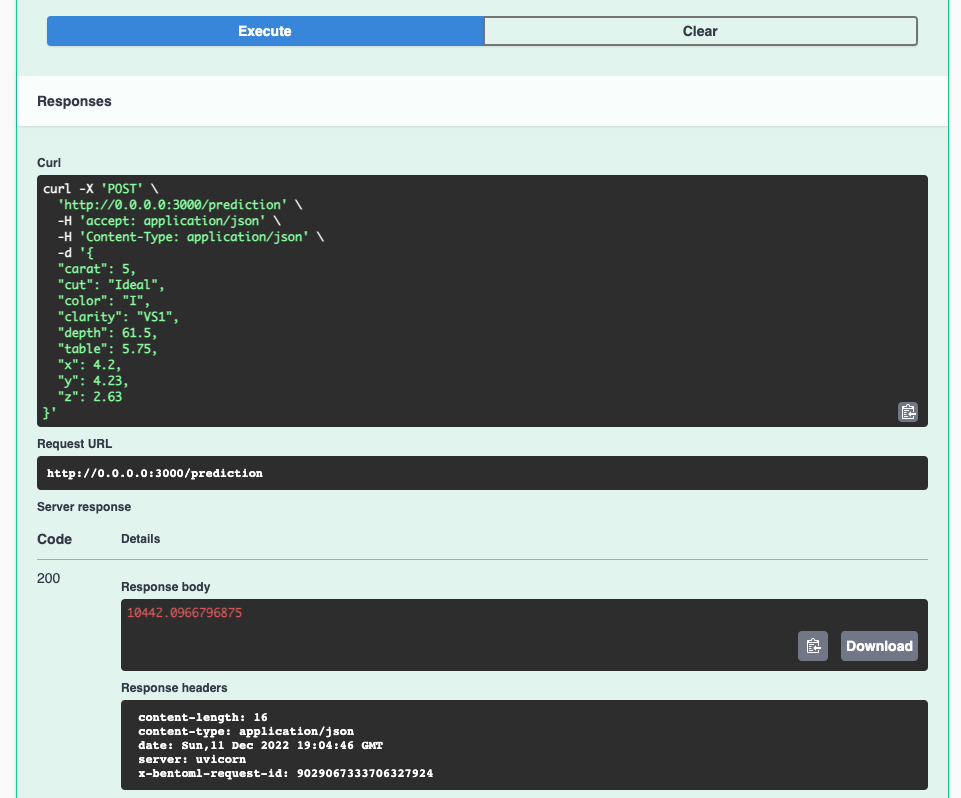
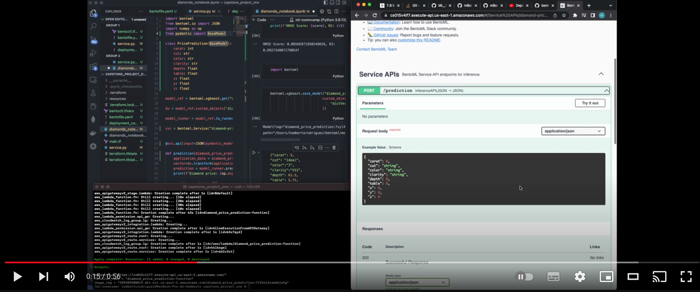

# Diamond Price Prediction Project


<em>Diamonds have a long history as beautiful objects of desire. In the first century AD, the Roman naturalist Pliny stated: “Diamond is the most valuable, not only of precious stones, but of all things in this world.

It forms deep in the earth under extreme heat and pressure. It’s ejected violently upward until it arrives at or near the earth’s surface. It’s forced from its hiding place by nature or by man. Then it’s cleaved and cut and polished until its natural beauty shines through.</em>

There are several aspects to take in consideration when buying a diamond. Specifically in our dataset these are the features analyzed:

- carat weight of the diamond (0.2--5.01)
- cut quality of the cut (Fair, Good, Very Good, Premium, Ideal)
- color diamond colour, from J (worst) to D (best)
- clarity a measurement of how clear the diamond is (I1 (worst), SI2, SI1, VS2, VS1, VVS2, VVS1, IF (best))
- x length in mm (0--10.74)
- y width in mm (0--58.9)
- z depth in mm (0--31.8)
- depth total depth percentage = z / mean(x, y) = 2 \* z / (x + y) (43--79)
- table width of top of diamond relative to widest point (43--95)

We applied to our dataset different machine learning models such as:

- Linear Regression
- Decision Trees Regresors
- Random Forest
- XGBoost
- K-Nearest Neighbor Regressor

This way, we were able to evaluate the best possible score/accuracy while predicting the value of cars. The main reasons for choosing this topic was because I wanted to know a little more about how the car market works, test our machine learning knowledge and ease the processs of acquiring a car.

If you are interested, you can get the dataset here: [Diamonds Price Prediction Dataset](https://www.kaggle.com/datasets/shivam2503/diamonds).

## Running the model

You can test it into your own machine by getting the docker image [diamond-price-prediction-v001](https://hub.docker.com/repository/docker/humbert1/diamond-price-prediction-v001) and run it locally.

### Prerequisites

- [Have Docker installed](https://docs.docker.com/get-docker/)

## Pull the image from the terminal

`docker pull humbert1/diamond-price-prediction-v001:latest`

## Start the service in terminal

`docker run -it --rm -p 3000:3000 humbert1/diamond-price-prediction-v001:latest serve --production`

## Using the service

You can use this API by opening [http://localhost:3000](http://localhost:3000) after starting the service:



By scrolling down you will find the **Service APIs**, click on the POST /predict arrow that faces down and click on "Try it out":

Copy and paste the below code in the Request body and click on execute:

```json
{
  "carat": 5,
  "cut": "Ideal",
  "color": "I",
  "clarity": "VS1",
  "depth": 61.5,
  "table": 5.75,
  "x": 4.2,
  "y": 4.23,
  "z": 2.63
}
```



You will get the price predicted based on the features we passed to the model:



## Deployment in AWS Lambda

You can see a short demo of this car price prediction model deployed in AWS Lambda:

[](https://youtu.be/X14PdG2QVn8)

In case you are interested how our Bento Model was containerized and deployed in AWS Lambda, you can view the [HOW_TO.md](HOW_TO.md)
