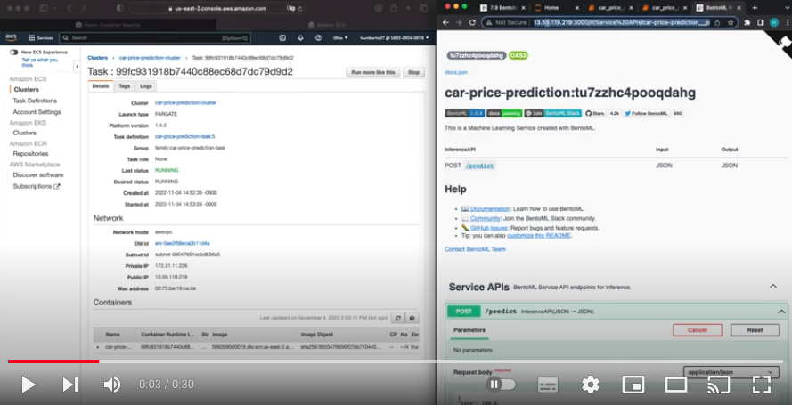
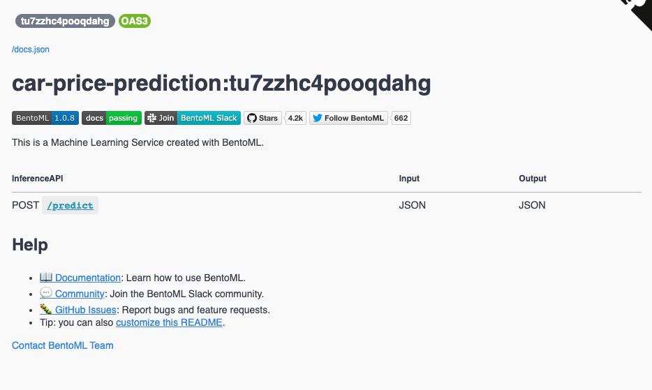
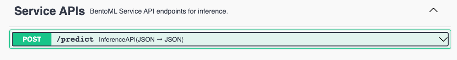
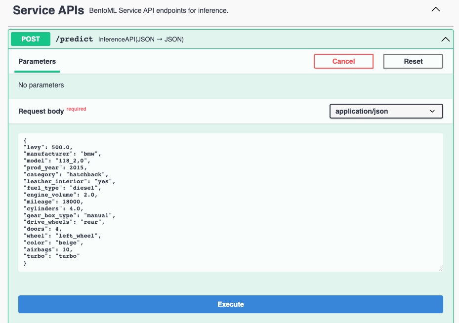
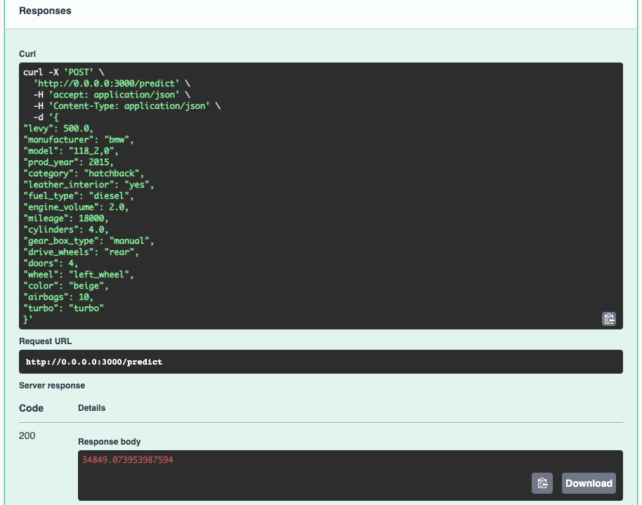

# Car Price Prediction Project

Buying a car can be a very exhausting process, there is a great variety of models,there are many factors that must be taken into consideration before being able to buy it according to the budget that one has. Our dataset consists of 16 variables that describe in detail the characteristics of these cars. We applied different machine learning models such as:

- Linear Regression
- Decision Trees Regresors
- Random Forest
- XGBoost

This way, we were able to evaluate the best possible score/accuracy while predicting the value of cars. The main reasons for choosing this topic was because I wanted to know a little more about how the car market works, test our machine learning knowledge and ease the processs of acquiring a car.

If you are interested, you can get the dataset here: [Car Price Prediction Dataset](https://www.kaggle.com/datasets/deepcontractor/car-price-prediction-challenge).

## How the model was built

The model was built with BentoML, which is an abstraction to pack different Machine Learning components into one deployable unit.

## Running the model

You can test it into your own machine by getting the docker image [humbert1/car-price-prediction](https://hub.docker.com/repository/docker/humbert1/car-price-prediction) and run it locally.

### Prerequisites

- [Have installed Docker](https://docs.docker.com/get-docker/)

## Downloading the image

`docker pull humbert1/car-price-prediction`

## Start the service

`docker run -it --rm -p 3000:3000 humbert1/car-price-prediction:latest serve --production`

## Deployment in AWS

You can see a short demo of this car price prediction model deployed in AWS.

## Using the service

You can use this API by opening [http://localhost:3000)](http://localhost:3000)

By scrolling down you will find the **Service APIs**, click on the POST /predict arrow that faces down.

Copy and paste the below code in the Request body and click on execute

`{ "levy": 500.0, "manufacturer": "bmw", "model": "118_2,0", "prod_year": 2015, "category": "hatchback", "leather_interior": "yes", "fuel_type": "diesel", "engine_volume": 2.0, "mileage": 18000, "cylinders": 4.0, "gear_box_type": "manual", "drive_wheels": "rear", "doors": 4, "wheel": "left_wheel", "color": "beige", "airbags": 10, "turbo": "turbo" }`

You will get the price predicted based on the fetures we passed to the model

