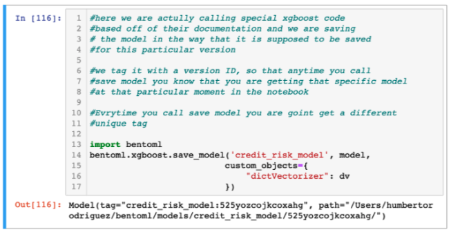
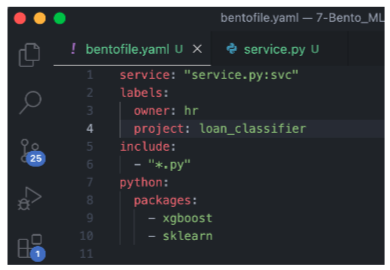
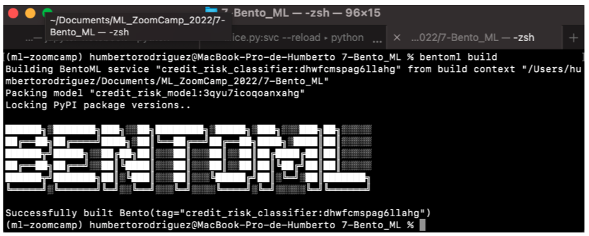
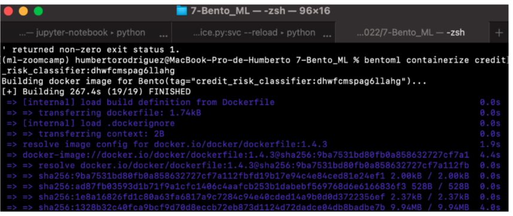
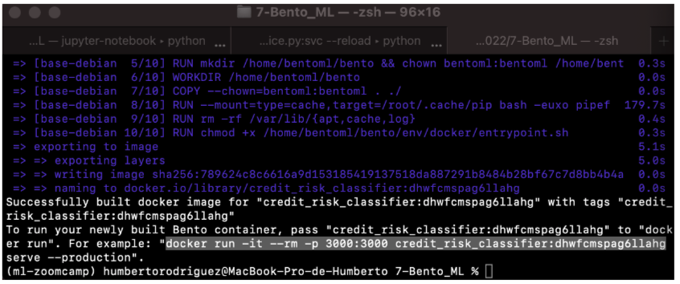

# Car Price Prediction Project

Buying a car can be a very exhausting process, there is a great variety of models,there are many factors that must be taken into consideration before being able to buy it according to the budget that one has. Our dataset consists of 16 variables that describe in detail the characteristics of these cars. We applied different machine learning models such as:

- Linear Regression
- Decision Trees Regresors
- Random Forest
- XGBoost

This way, we were able to evaluate the best possible score/accuracy while predicting the value of cars. The main reasons for choosing this topic was because I wanted to know a little more about how the car market works, test our machine learning knowledge and ease the processs of acquiring a car.

If you are interested, you can get the dataset here: [Car Price Prediction Dataset](https://www.kaggle.com/datasets/deepcontractor/car-price-prediction-challenge).

## How the model was built and containerized

The model was built with BentoML, which is an abstraction to pack different Machine Learning components into one deployable unit. you can `pip install bentoml` to install it. You can visit: [BentoML](https://docs.bentoml.org/en/latest/index.html) for further details.

In order to build your model with BentoML you need to run in your code of your final selected model the following lines:

`bentoml.sklearn.save_model("car_price_prediction", model, custom_objects={ "dictVectorizer": dv }) bentoml.sklearn.save_model("car_price_prediction", model, custom_objects={ "dictVectorizer": dv }) `

This will provide a model with a tag which will be used to build our bento image and docker image.

Before we can build our images, we need to create a bentofile.yaml specifiying the following:

- service: "service.py:svc" -> Determine the entry point and the variable name for the service. We wont have to specify it anymore since we have called it out in the service.

- labels: key value pair specify anything that is valuable to your and your business of what is involved in this bento.

  - owner: hr
  - project: default-prediction

- include: which files you want to include/pull in with your bento and which don't specially if your bento is part of a larger repo.

  - "\*.py"

- python: which python packages you need for your service.
  - packages:
    - xgboost
    - sklearn

Now we can build our images, from the CLI type:

`bentoml build`

This deployable includes all the things that we are going to need for a service in one single place, so when we containerize it you have a single image that you can deploy into a lot of different environments including:

- README files ->
- openapi.yaml -> which is the spec that enables you to have the Swagger UI
- bento.yaml -> the file that glues everything together
- Dockerfile
- python requirements
- models -> where it shows our custom objects, where the DictVectorizer is stored

Now we can build our Docker image:

`bentoml containerize <tag of your previous BentoML deployable you built>`

When it finishes, it will provide your Docker image with a command to run it. from your terminal run it: docker run -it --rm -p 3000:3000 credit_risk_classifier:dhwfcmspag6llahg

## Running the model

You can test it into your own machine by getting the docker image [humbert1/car-price-prediction](https://hub.docker.com/repository/docker/humbert1/car-price-prediction) and run it locally.

### Prerequisites

- [Have Docker installed](https://docs.docker.com/get-docker/)

## Downloading the image

`docker pull humbert1/car-price-prediction`

## Start the service

`docker run -it --rm -p 3000:3000 humbert1/car-price-prediction:latest serve --production`

## Using the service

You can use this API by opening [http://localhost:3000](http://localhost:3000) after starting the service:

By scrolling down you will find the **Service APIs**, click on the POST /predict arrow that faces down:

Copy and paste the below code in the Request body and click on execute:

`{ "levy": 500.0, "manufacturer": "bmw", "model": "118_2,0", "prod_year": 2015, "category": "hatchback", "leather_interior": "yes", "fuel_type": "diesel", "engine_volume": 2.0, "mileage": 18000, "cylinders": 4.0, "gear_box_type": "manual", "drive_wheels": "rear", "doors": 4, "wheel": "left_wheel", "color": "beige", "airbags": 10, "turbo": "turbo" }`

You will get the price predicted based on the features we passed to the model:

## Deployment in AWS

You can see a short demo of this car price prediction model deployed in AWS:

